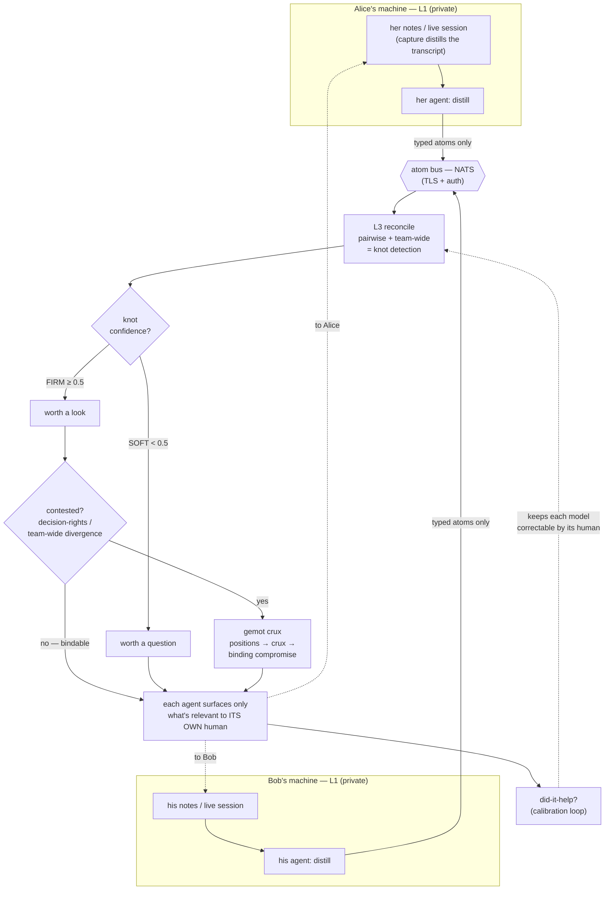
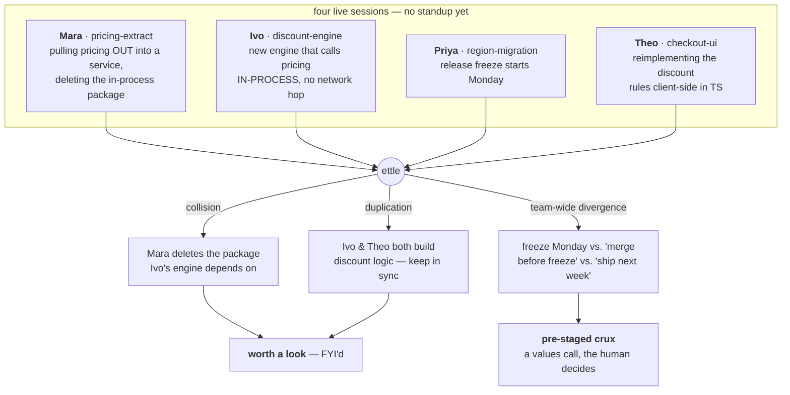

# ettle

A rolling shared horizon of minimized surprise for a high-trust team whose members already think through their work with AI agents.

Each person's agent models its own human (the single-user layer). It also keeps a directed model of each teammate, from its own vantage. A merged collective layer reconciles those models and surfaces the deltas that would otherwise become a surprise — a dependency someone is about to break, two people converging on the same work, an assumption one person holds that another has quietly abandoned. The aim is that coordination mostly happens before anyone notices they would have needed a meeting.

It is easy to misread as "a shared dashboard." It is the opposite: your raw notes are never transmitted verbatim — your agent distills them into typed atoms and only those cross; there is no shared channel humans read (your own agent surfaces only what's relevant to *you*); and friction is kept on purpose — but only at the genuine choices a human should own. (The distillation is a model judgment, not a verified redaction — what an atom *contains* is the real privacy surface, not the raw note. See [SECURITY.md](SECURITY.md).)



*Full reading guide: [docs/ARCHITECTURE.md](docs/ARCHITECTURE.md).*

The name is a Scots / Northern-English verb: **to intend, to aim at, to plan or prepare ahead.** The system's job is to ettle on the team's behalf — to act on intent ahead of time — not merely to record shared state.

The aim is not "frictionless." It is **friction in the right spots**: remove it from coordination and status-sync (the bullshit-meeting toil → zero), and keep it exactly where a genuine values choice belongs to a person — surfaced as a clean, pre-staged either/or, never auto-decided by the mesh. The felt result: empowered and free of bullshit meetings, while still getting the benefit of having had a great meeting, because the mesh held it on everyone's behalf.

**What this repo is:** a runnable proof-of-concept (`cmd/ettle` — see [Quickstart](#quickstart)) *and* the design reasoning behind the larger system it's the first wedge into (the `docs/`). The CLI is what runs today; the essays are the thinking, marked clearly where they extrapolate ([HORIZON.md](docs/HORIZON.md) is explicitly the speculative end-state). If you want the tool, start with the Quickstart and [the example run](docs/EXAMPLE_RUN.md); if you want the ideas, start with [ARCHITECTURE](docs/ARCHITECTURE.md) and [CONCEPT](docs/CONCEPT.md).

## Status

What runs today is the coordination **engine**: it distills typed atoms from each person's working notes or live session, reconciles them across the team, and surfaces only the knots (collisions, duplicated work, stale assumptions, decision-rights gaps), routing each FIRM-vs-SOFT and sending contested ones to a crux. Accuracy is not yet broadly validated — but it's now *inspectable*: `ettle eval testdata/eval/*.json` scores precision/recall against a committed synthetic corpus you can read, and `--ab` runs the honest single-shot-vs-voting comparison with a McNemar test (which, at this corpus size, correctly declines to claim voting helps).

The opening paragraphs above describe the **design**; what's **deliberately unbuilt** is the part that needs the most care — the L2 directed-model mesh, the longitudinal calibration loop that keeps each model correctable, and the continuous live-emit path (gated on the anti-runaway requirements in [SCALING.md](docs/SCALING.md)). The detector (the fast people-modeling half) runs; the correction half does not yet, so any safety claim that leans on calibration is, for now, borrowing against unbuilt code — see [CONCEPT.md](docs/CONCEPT.md). Concept demos exist as local simulations on cheap models (agents standing in for the humans) to show the payoff shape; those are illustrations, not the product.

## Quickstart

Requires **Go ≥ 1.25** and one Anthropic API key.

```sh
# one Anthropic API key in .env (see .env.example)
cp .env.example .env && $EDITOR .env

# surface the coordination knots across a team's notes — no meeting
go run ./cmd/ettle standup --me alice testdata/standup/*.md

# or run it on real LIVE sessions — Claude Code transcripts, not notes —
# the L1 layer that distills what each person actually reasoned about and did
go run ./cmd/ettle standup testdata/sessions/*.jsonl
go run ./cmd/ettle capture testdata/sessions/kit.jsonl   # preview what a session distills to
go run ./cmd/ettle standup --show-atoms testdata/sessions/*.jsonl   # see exactly what crosses the boundary

# useful at N=1 too: one person's own stale self-assumption
go run ./cmd/ettle standup testdata/solo/dana.md

# stabilize the stochastic detector by majority-voting across samples
go run ./cmd/ettle standup --samples 3 --me alice testdata/standup/*.md
```

Each note file is one participant (an optional `name:` / `role:` header, then
their working notes). `--me` shows only what's relevant to that person; drop it
for the full team view. Cost is ~2N+3 model calls for N participants (cheap on
Haiku); `--samples K` re-runs the reconcile passes K times and keeps only knots
that recur across a majority (the detector is stochastic — voting turns that into
a confidence signal, at +2 calls per extra sample). It's **useful at N=1**: a
single person's notes still get a self-assumption pass (an earlier assumption
their own later work has quietly made false). It runs with **no infrastructure**
— the transport defaults to in-process and contested knots fall back to an inline
either/or.

**See [docs/EXAMPLE_RUN.md](docs/EXAMPLE_RUN.md) for exactly what it prints** on
the bundled fixture — no key needed to read it.

### Demo

A fully-synthetic four-person team ([`testdata/northwind/`](testdata/northwind)
— four Claude Code **session transcripts**, no real data). Four people, four live
sessions, nobody has synced. Their work is quietly colliding:



A real run on Ivo's horizon (`ettle standup --me ivo testdata/northwind/*.jsonl`,
trimmed to three of the knots it surfaces) — the collision and the freeze crux,
before the meeting:

```
  ettle — coordination horizon for ivo
  22 atoms across 4 people; 6 knots surfaced

  worth a look (firm)
    • [collision] pricing package removal during discount-engine build
      Ivo's discount engine depends on in-process pricing calls through end of
      next week, but Mara commits to deleting the pricing package once her
      service goes live — a direct conflict if her extraction lands first.
      parties: ivo, mara · confidence 0.6
    • [duplication] discount rules implementation in two codebases
      Ivo is building discount rules in the orders service while Theo
      reimplements the same rules in TypeScript on the checkout client —
      duplication and a long-term sync burden.
      parties: ivo, theo · confidence 1.0
    • [teamwide-divergence] pricing package refactoring timeline
      Ivo expects pricing in-process through next week; Mara plans to extract
      and delete it before the freeze; Priya's two-week freeze starts Monday —
      the three timelines can't all hold.
      parties: ivo, mara, priya · confidence 0.6
      → crux (inline): pricing package refactoring timeline
        ↳ as ivo frames it / as the other parties frame it
```

Three things to notice: the **collision is caught before the standup** that
would otherwise have surfaced it; the simple conflicts are **FYI'd** while the
genuine values choice (the freeze timeline) is **routed to a crux** and
pre-staged as an either/or — friction in the right spot, not everywhere; and
it's **useful at N=1** too — `ettle standup testdata/solo/dana.md` catches one
person's own stale assumption. (The detector is stochastic, so wording and the
exact knot set shift run-to-run; a knot resting only on an inference is surfaced
as a *question* — "worth a question" — rather than asserted as fact.) Add
`--show-atoms` to any run to see exactly what crosses the boundary (typed atoms,
never the raw session).

Going distributed and secure is opt-in behind the same seams:

```sh
# atoms over a NATS bus (TLS + auth); needs the build tag
go run -tags nats ./cmd/ettle standup --transport nats --me alice notes.md

# route contested knots to a real gemot deliberation (TLS + bearer token)
go run ./cmd/ettle standup --gemot https://gemot.example/mcp ...
```

## Docs

- [docs/ARCHITECTURE.md](docs/ARCHITECTURE.md) — **start here:** a diagram of the whole flow and the three things that make it unintuitive.
- [docs/EXAMPLE_RUN.md](docs/EXAMPLE_RUN.md) — real output on the bundled fixture (no key needed to read).
- [docs/CONCEPT.md](docs/CONCEPT.md) — **the spine:** the premise, the three-layer model, surprise as metaperception error, the critical path, and the non-negotiable design invariants.
- [docs/N1_WEDGE.md](docs/N1_WEDGE.md) — the first buildable behavior (the prior-decision guard) and its did-it-help signal.
- [docs/TEAM_SIM.md](docs/TEAM_SIM.md) — the multiplayer payoff: agents negotiate, bind the toil, surface the cruxes. Friction in the right spots.
- [docs/HORIZON.md](docs/HORIZON.md) — the extrapolated end-state (the vision and its shadow).
- [docs/COMMONS.md](docs/COMMONS.md) — coordinated quality without wasted time as a commons; Ostrom's eight principles mapped to ettle, with graduated sanctions on gemot reputation.
- [docs/SCALING.md](docs/SCALING.md) — how the continuous version avoids a token-burn feedback loop (atoms up, knots down; L3 emits no atoms; surprise-gated emit; O(1) shared reconcile).
- [docs/PRIOR_ART.md](docs/PRIOR_ART.md) — literature and product map, with citations.
- [docs/ADOPTION.md](docs/ADOPTION.md) — consent-first, bottom-up adoption; the anti-viral stance.
- [docs/SF_LINEAGE.md](docs/SF_LINEAGE.md) — the fictional touchstones and the bright/dark fork they mark.
- [docs/NAMING.md](docs/NAMING.md) — why `ettle`, and the collisions that ruled out the alternatives.

## Relationship to sibling projects

- **the single-user layer (L1)** — ettle ships its own minimal L1: [`internal/capture`](internal/capture) distills a person's **live Claude Code session transcript** (their stated intent + the work they committed) into the same digest a note would be, so the public tool runs end-to-end on real reasoning-in-progress, not just hand-written notes (`ettle standup session.jsonl`). A richer per-person model (deeper L1 telemetry) can feed this layer from outside this repo; ettle is the multiplayer extension on top — the directed and collective layers, plus the actionable layer, that a single-user layer never had.
- **the atom bus** — a [NATS](https://nats.io) bus moves typed atoms between participants' machines (TLS + auth, pub/sub, replay). Behind a transport seam, so a zero-infra in-process adapter covers local testing and other rails (Slack, Matrix, A2A) can drop in later.
- **the human-legible side** — there is no shared human channel: each person's own agent surfaces the relevant knot back to them, in-session, when helpful. You only ever see what your own agent judged relevant to you.
- **a calibration-metric store** — typed agent memory with a longitudinal metric; the natural home for scoring how well each agent's model of each teammate stays calibrated over time.
- **[gemot](https://github.com/justinstimatze/gemot)** — structured deliberation (positions → cruxes → binding compromise, with EigenTrust reputation). The inter-agent negotiation organ for *contested* knots: it locates the crux (where friction belongs) and binds the rest, and its reputation deltas become the team-tier calibration signal. Reached over TLS with auth — the crux is the most sensitive payload on the wire.
