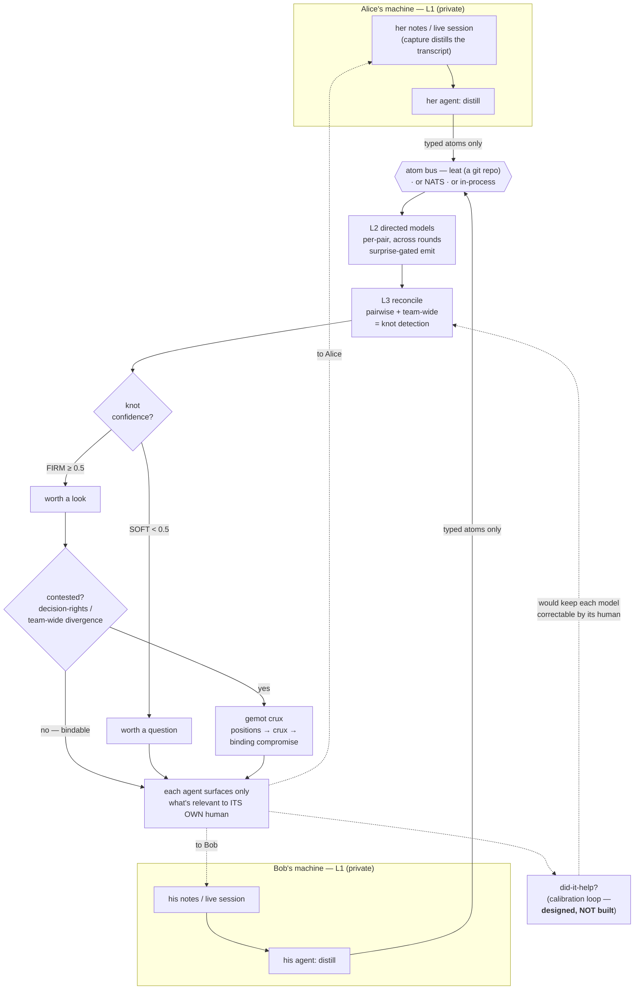
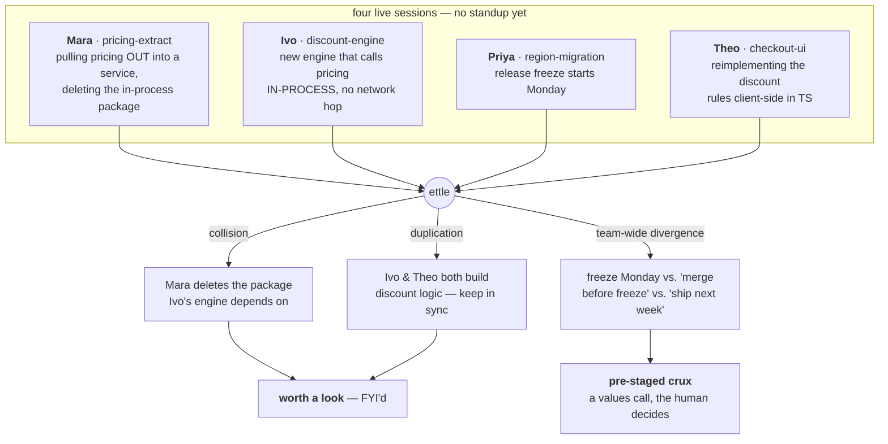

# ettle

A forest looks like a stand of separate trees. Underground, a fungal network wires their roots together — moving what each tree needs to where it's needed, and carrying a warning from the tree that hit a threat to the ones that haven't met it yet.

ettle is that network for a team that already works through AI agents. Run it, and everyone's working state links up for a moment: the dependency you're about to break, the work two of you are duplicating, the assumption you're holding that someone else quietly dropped — each reaches the person who needs it, and no one else, *before* it becomes the meeting you'd have had to call.

No standup to surface it. No thread half-read. The signal arrives where it's relevant. That's the pitch.

> ⚠️ **Extremely early — a design-stage proof-of-concept, shared well before it's proven.** The
> coordination engine runs, but its accuracy is **not validated**: `ettle eval` is an inspectable smoke
> test on a tiny synthetic corpus, not a precision/recall measurement, and the demos are hand-seeded. The
> headline N=1 *safety* wedge — a prior-decision guard — and the calibration loop that is supposed to make
> any of this *safe* are **specced, not built**; the working N=1 demo below (a stale-self-assumption pass)
> is a narrower slice that runs today, **not** that wedge (see [Status](#status)). Plenty here is probably wrong. Treat it as a thesis with
> a runnable skeleton, not a product. Read the `docs/` caveats before trusting anything; breakage and
> rethinks expected, feedback very welcome.

A rolling shared horizon of minimized surprise for a high-trust team whose members already think through their work with AI agents.

Mechanically, what runs today: each person's agent distills their notes or live session into typed atoms — only those cross, never the raw text — and a reconcile pass compares them across the team, surfacing the deltas that would otherwise become a surprise (a dependency someone is about to break, two people converging on the same work, an assumption one person holds that another has quietly abandoned). Between distill and reconcile sits the *directed-model layer* — L2, what your agent believes each teammate is assuming, held per-pair and carried across rounds so it can go **stale**. Its structural half now runs (`ettle drift`): each session emits only the deltas that would leave a teammate's model of it stale — the staleness is *computed*, not guessed — so a change reaches exactly the teammates it affects, before it becomes a surprise. (What's still open there is the *semantic* enrichment — your agent inferring what a teammate is assuming beyond what they stated — and the calibration loop; see [Status](#status).) The aim is that coordination mostly happens before anyone notices they would have needed a meeting.

It is easy to misread as "a shared dashboard." It is the opposite: your raw notes are never transmitted verbatim — your agent distills them into typed atoms and only those cross; there is no shared channel humans read (your own agent surfaces only what's relevant to *you*); and friction is kept on purpose — but only at the genuine choices a human should own. (The distillation is a model judgment, not a verified redaction — what an atom *contains* is the real privacy surface, not the raw note. See [SECURITY.md](SECURITY.md).)



*Full reading guide: [docs/ARCHITECTURE.md](docs/ARCHITECTURE.md).*

The name is a Scots / Northern-English verb: **to intend, to aim at, to plan or prepare ahead.** The system's job is to ettle on the team's behalf — to act on intent ahead of time — not merely to record shared state.

The aim is not "frictionless." It is **friction in the right spots**: remove it from coordination and status-sync (the bullshit-meeting toil → zero), and keep it exactly where a genuine values choice belongs to a person — surfaced as a clean, pre-staged either/or, never auto-decided by the mesh. The felt result: empowered and free of bullshit meetings, while still getting the benefit of having had a great meeting, because the mesh held it on everyone's behalf.

**What this repo is:** a runnable proof-of-concept (`cmd/ettle` — see [Quickstart](#quickstart)) *and* the design reasoning behind the larger system it's the first wedge into (the `docs/`). The CLI is what runs today; the essays are the thinking, marked clearly where they extrapolate ([HORIZON.md](docs/HORIZON.md) is explicitly the speculative end-state). If you want the tool, start with the Quickstart and [the example run](docs/EXAMPLE_RUN.md); if you want the ideas, start with [ARCHITECTURE](docs/ARCHITECTURE.md) and [CONCEPT](docs/CONCEPT.md).

## Status

What runs today is the coordination **engine**: it distills typed atoms from each person's working notes or live session, reconciles them across the team, and surfaces only the knots (collisions, duplicated work, stale assumptions, decision-rights gaps), routing each FIRM-vs-SOFT and sending contested ones to a crux. Accuracy is **not validated** — but it's *inspectable*: `ettle eval testdata/eval/*.json` is a small, readable **smoke test** (run the detector against a committed synthetic corpus, see where it hits and misses). It is a sanity check, **not** a precision/recall measurement — the corpus is tiny and has only a handful of labels, and the `--ab` voting comparison ships a McNemar test that on this corpus never reaches the sample size to claim anything (the machinery is there, waiting for a corpus big enough to feed it). A second, orthogonal harness measures the **privacy boundary** rather than detection accuracy: `ettle eval --leak testdata/leak/*.json` plants private facts that must not cross (a comp number, a credential, a medical reason, a private opinion), distills each note, and reports the **leak rate** — plus a must-cross check so a zero leak rate earned by emitting nothing is flagged as over-redaction, not success. Same honest caveat: synthetic corpus, deliberately liberal matcher (it over-counts a leak before it under-counts one).

The **directed-model layer (L2)** now runs in its structural form: `ettle drift <prev-dir> <curr-dir>` builds each agent's per-pair model of every teammate, carries it across two rounds, and emits only the deltas that would leave a teammate's model stale — the surprise-gated emit rule and the L2-vs-L1 staleness diff, computed deterministically (no extra model call). It is unit-tested without an API key and demonstrated on [`testdata/drift/`](testdata/drift). Two honest limits bound it: it routes by an exact `(type, subject)` slot key, so when the **stochastic distiller rewords** the subject of a still-held belief the diff reads it as drop+new rather than a reword (savings hold per-*person*, not per-*belief*; the surfaced "stale" line is hedged, not asserted, because of this); and the **semantic** enrichment — an agent inferring what a teammate is assuming *beyond* their stated atoms — is unbuilt. Both are what would make L2 more than a wording-sensitive structural projection; closing the first needs wording-independent slot identity (tracked). The *read* side of that layer now runs too: `ettle mirror --me <name> <prev-dir> <curr-dir>` shows a person what the team's directed models currently believe *about them*, flagging the beliefs that have gone **stale** — the same layer that drives how someone is treated, made legible to the person it's about (attribution coarsened by default, `--by-observer` to attribute; no model call beyond the distill).

The opening paragraphs above describe the **design**; what's **deliberately unbuilt** is the part that needs the most care — the longitudinal calibration loop that keeps each model correctable, and the continuous live-emit path (gated on the anti-runaway requirements in [SCALING.md](docs/SCALING.md)). The detector (the fast people-modeling half) runs; the correction half does not yet, so any safety claim that leans on calibration is, for now, borrowing against unbuilt code — see [CONCEPT.md](docs/CONCEPT.md). Concept demos exist as local simulations on cheap models (agents standing in for the humans) to show the payoff shape; those are illustrations, not the product.

## Quickstart

Requires **Go ≥ 1.25** and one Anthropic API key — *one per room, not one per
person*: teammates driving ettle from their own agent (Claude Code, Cursor) can
distill locally and never need a key of their own. See the `ettle_distill` note
at the end of this block.

```sh
# one Anthropic API key in .env (see .env.example)
cp .env.example .env && $EDITOR .env

# surface the coordination knots across a team's notes — no meeting
go run ./cmd/ettle standup --me alice testdata/standup/*.md

# or run it on real LIVE sessions — Claude Code transcripts, not notes —
# the L1 layer that distills what each person actually reasoned about and did
go run ./cmd/ettle standup testdata/sessions/*.jsonl
go run ./cmd/ettle capture testdata/sessions/kit.jsonl   # preview what a session distills to
go run ./cmd/ettle standup --show-atoms testdata/sessions/*.jsonl   # see exactly what crosses the boundary

# measure the privacy boundary: plant secrets, distill, report the leak rate
go run ./cmd/ettle eval --leak testdata/leak/*.json

# useful at N=1 too: one person's own stale self-assumption
go run ./cmd/ettle standup testdata/solo/dana.md

# L2: directed per-pair models across two rounds — emit only what changed,
# routed to whoever's model of someone went stale (the surprise-gated emit rule)
go run ./cmd/ettle drift --me ivo testdata/drift/r1 testdata/drift/r2

# the read side: what the team's models believe ABOUT you, stale flagged
# (turning the one-way mirror around; --by-observer to attribute each belief)
go run ./cmd/ettle mirror --me ivo testdata/drift/r1 testdata/drift/r2

# stabilize the stochastic detector by majority-voting across samples
go run ./cmd/ettle standup --samples 3 --me alice testdata/standup/*.md

# serve the engine over MCP so any agent (Claude Code, Cursor) drives it directly:
# each person's own agent calls ettle_emit with that person's notes, ettle_horizon
# reconciles the team's atoms into knots — no hand-assembled note files
claude mcp add ettle -- go run ./cmd/ettle mcp

# ...and if you already live in Claude Code, you don't need an API key to take
# part: ask for the `ettle_distill` prompt and YOUR agent distills your notes
# locally, then calls ettle_emit with `atoms` instead of `notes`. The raw notes
# never leave your machine and the server makes no model call for your emit.
# Only whoever runs reconcile (ettle_horizon) needs a key — one per room, not
# one per person.

# multiplayer with NO broker: point at a folder the team already shares
# (Dropbox/Drive/git/Syncthing). Each agent writes only its own file under
# .ettle/; reconcile reads the folder. Securing the folder is the sync tool's job.
go run ./cmd/ettle standup --me alice --transport file:///path/to/shared testdata/standup/*.md
```

Each note file is one participant (an optional `name:` / `role:` header, then
their working notes). A note can also add a `private:` header listing
comma-separated phrases that must never cross the boundary
(`private: relocating to Lisbon, comp adjustment`) — they are stripped from that
person's atoms by both a prompt suppress-list and a deterministic redaction (see
[SECURITY.md](SECURITY.md)). `--me` shows only what's relevant to that person;
drop it for the full team view. Cost is ~2N+3 model calls for N participants (cheap on
Haiku); `--samples K` re-runs the reconcile passes K times and keeps only knots
that recur across a majority (the detector is stochastic — voting turns that into
a confidence signal, at +2 calls per extra sample). It's **useful at N=1**: a
single person's notes still get a self-assumption pass (an earlier assumption
their own later work has quietly made false). It runs with **no infrastructure**
— the transport defaults to in-process and contested knots fall back to an inline
either/or.

**See [docs/EXAMPLE_RUN.md](docs/EXAMPLE_RUN.md) for exactly what it prints** on
the bundled fixture — no key needed to read it.

### Demo

A fully-synthetic four-person team ([`testdata/northwind/`](testdata/northwind)
— four Claude Code **session transcripts**, no real data). Four people, four live
sessions, nobody has synced. Their work is quietly colliding:



A real run on Ivo's horizon (`ettle standup --me ivo testdata/northwind/*.jsonl`,
trimmed to three of the knots it surfaces) — the collision and the freeze crux,
before the meeting:

```
  ettle — coordination horizon for ivo
  22 atoms across 4 people; 6 knots surfaced

  worth a look (firm)
    • [collision] pricing package removal during discount-engine build
      Ivo's discount engine depends on in-process pricing calls through end of
      next week, but Mara commits to deleting the pricing package once her
      service goes live — a direct conflict if her extraction lands first.
      parties: ivo, mara · confidence 0.6
    • [duplication] discount rules implementation in two codebases
      Ivo is building discount rules in the orders service while Theo
      reimplements the same rules in TypeScript on the checkout client —
      duplication and a long-term sync burden.
      parties: ivo, theo · confidence 1.0
    • [teamwide-divergence] pricing package refactoring timeline
      Ivo expects pricing in-process through next week; Mara plans to extract
      and delete it before the freeze; Priya's two-week freeze starts Monday —
      the three timelines can't all hold.
      parties: ivo, mara, priya · confidence 0.6
      → crux (inline): pricing package refactoring timeline
        ↳ as ivo frames it / as the other parties frame it
```

Three things to notice: the **collision is caught before the standup** — across
four sessions nobody had read, which is the point (reach and timing, not that a
human couldn't eventually have spotted it); the simple conflicts are **FYI'd** while the
genuine values choice (the freeze timeline) is **routed to a crux** and
pre-staged as an either/or — friction in the right spot, not everywhere; and
it's **useful at N=1** too — `ettle standup testdata/solo/dana.md` catches one
person's own stale assumption. (The detector is stochastic, so wording and the
exact knot set shift run-to-run; a knot resting only on an inference is surfaced
as a *question* — "worth a question" — rather than asserted as fact.) Add
`--show-atoms` to any run to see exactly what crosses the boundary (typed atoms,
never the raw session).

Going distributed is opt-in behind the same seam — and the light path needs **no server at all**, just a private git repo. The git URL is the invite:

```sh
# the bus is a private git repo. one person starts it, everyone else joins:
go run ./cmd/ettle room init git@github.com:crew/standup-room.git   # first person — creates + seeds it
go run ./cmd/ettle room join git@github.com:crew/standup-room.git   # everyone else, on their own machine
# then day-to-day there are no env vars, no paths, no flags to remember:
go run ./cmd/ettle standup --room standup-room --me alice notes.md
# or just see who's in the room and what each is working on — the presence view,
# read straight off the bus, no knot detection and no model call:
go run ./cmd/ettle room status standup-room
# (under the hood --room rides leat: each agent appends only its own lane so
#  pushes never conflict, identity is hardened — a line whose author != its lane
#  is dropped — and git log is the audit trail. --room resolves to the leat://
#  transport, so the raw form is also available: --transport leat://<clone>.)

# heavier alternative — atoms over a NATS bus (TLS + auth); needs the build tag
go run -tags nats ./cmd/ettle standup --transport nats --me alice notes.md

# route contested knots to a real gemot deliberation (TLS + bearer token)
go run ./cmd/ettle standup --gemot https://gemot.example/mcp ...
```

## Docs

- [docs/ARCHITECTURE.md](docs/ARCHITECTURE.md) — **start here:** a diagram of the whole flow and the three things that make it unintuitive.
- [docs/EXAMPLE_RUN.md](docs/EXAMPLE_RUN.md) — real output on the bundled fixture (no key needed to read).
- [docs/CONCEPT.md](docs/CONCEPT.md) — **the spine:** the premise, the three-layer model, surprise as metaperception error, the critical path, and the non-negotiable design invariants.
- [docs/N1_WEDGE.md](docs/N1_WEDGE.md) — the first buildable behavior (the prior-decision guard) and its did-it-help signal.
- [docs/TEAM_SIM.md](docs/TEAM_SIM.md) — the multiplayer payoff: agents negotiate, bind the toil, surface the cruxes. Friction in the right spots.
- [docs/HORIZON.md](docs/HORIZON.md) — the extrapolated end-state (the vision and its shadow).
- [docs/COMMONS.md](docs/COMMONS.md) — coordinated quality without wasted time as a commons; Ostrom's eight principles mapped to ettle, with graduated sanctions on gemot reputation.
- [docs/SCALING.md](docs/SCALING.md) — how the continuous version avoids a token-burn feedback loop (atoms up, knots down; L3 emits no atoms; surprise-gated emit; O(1) shared reconcile).
- [docs/DEPLOY.md](docs/DEPLOY.md) — running it for a team: the NATS bus and gemot endpoint, the secrets they need, and what to *not* turn on until calibration lands.
- [docs/PRIOR_ART.md](docs/PRIOR_ART.md) — literature and product map, with citations.
- [docs/CALO_LINEAGE.md](docs/CALO_LINEAGE.md) — the personal-assistant-agent lineage (Maes/CAP, DARPA PAL's CALO & RADAR, Electric Elves) and what ettle inherits vs. extends.
- [docs/BENCHMARKS.md](docs/BENCHMARKS.md) — candidate public datasets for validating the detector on real logged coordination, and the honest method/caveats.
- [docs/ADOPTION.md](docs/ADOPTION.md) — consent-first, bottom-up adoption; the anti-viral stance.
- [docs/SF_LINEAGE.md](docs/SF_LINEAGE.md) — the fictional touchstones and the bright/dark fork they mark.
- [CONTRIBUTING.md](CONTRIBUTING.md) — where help matters most, ranked by leverage (the unbuilt calibration loop first), gated on the non-negotiable invariants.

## Relationship to sibling projects

- **the single-user layer (L1)** — ettle ships its own minimal L1: [`internal/capture`](internal/capture) distills a person's **live Claude Code session transcript** (their stated intent + the work they committed) into the same digest a note would be, so the public tool runs end-to-end on real reasoning-in-progress, not just hand-written notes (`ettle standup session.jsonl`). A richer per-person model (deeper L1 telemetry) can feed this layer from outside this repo; ettle is the multiplayer extension on top — the directed and collective layers, plus the actionable layer, that a single-user layer never had.
- **the atom bus** — behind a transport seam, so it swaps freely. Default is zero-infra in-process (local runs/tests). For a distributed team the light path is **[leat](https://github.com/justinstimatze/leat)** — a private git repo used as an append-only, per-author-lane message bus (durable, cross-machine, identity-hardened, `git log` = the audit trail; a stdlib-only Go package owned by [mcp-dispatch](https://github.com/justinstimatze/mcp-dispatch), the canonical impl of a shared git-transport wire contract, which ettle consumes). A [NATS](https://nats.io) bus (TLS + auth, pub/sub, replay) is the heavier alternative behind `-tags nats`; other rails (Slack, Matrix, A2A) can drop in later.
- **the human-legible side** — there is no shared human channel: each person's own agent surfaces the relevant knot back to them, in-session, when helpful. You only ever see what your own agent judged relevant to you.
- **a calibration-metric store** — typed agent memory with a longitudinal metric; the natural home for scoring how well each agent's model of each teammate stays calibrated over time.
- **[gemot](https://github.com/justinstimatze/gemot)** — structured deliberation (positions → cruxes → binding compromise, with EigenTrust reputation). The inter-agent negotiation organ for *contested* knots: it locates the crux (where friction belongs) and binds the rest, and its reputation deltas become the team-tier calibration signal. Reached over TLS with auth — the crux is the most sensitive payload on the wire.
