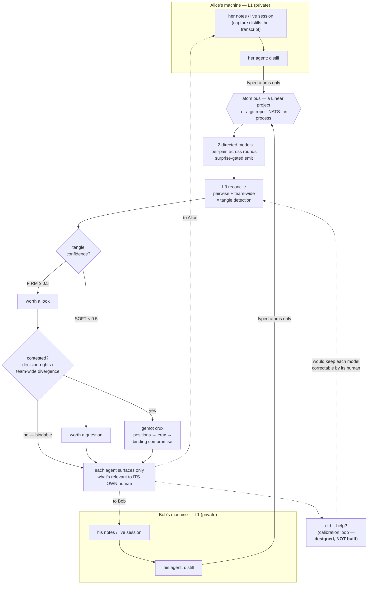
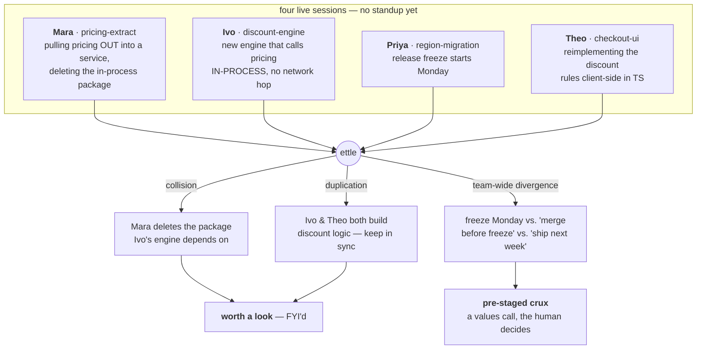

# ettle

Everyone on my team works through Claude Code all day. We message each other when something has already gone wrong. There's no standup to skip and no meeting to fix — the work just runs into itself, and you find out as a merge conflict, or as an afternoon two people spent building the same thing.

That gap used to be covered by the implementation window. Building was slow enough that alignment happened in the seams: a message while someone was still writing the code, a comment on a draft PR, a question in a meeting that was going to happen anyway. Agents collapsed the window, the seams went with it, and the pull request now carries every checkpoint that used to be spread across a week — arriving at the one moment when changing course costs the most.

ettle puts the checkpoints back without adding a place to go. Each person's agent distills their own session into typed atoms — what they're working on, what they've committed to, what they depend on, what they're assuming. Only the atoms cross; the raw session never leaves the machine. A reconcile pass compares them across the team and surfaces just the friction — the dependency you're about to break, the work two of you are duplicating, the assumption you're holding that someone else quietly dropped — privately, in your own next session, before it's the thing you'd have called a meeting about.

The other answer to this is a shared workspace: move the team into one multiplayer room and coordinate there. (GitHub Next's Ace is the clearest version — [One Developer, Two Dozen Agents, Zero Alignment](https://maggieappleton.com/zero-alignment) is worth your time either way.) That works if your team will move. Mine won't: we already have the shared room, and we route around it. So ettle assumes the opposite — nobody changes tools, nothing lands anywhere shared unless you decide to put it there, and it's useful at N=1 before a second person ever joins.

> ⚠️ **Very early — a design-stage proof-of-concept, published well before it's proven.** The engine
> runs; its accuracy is unmeasured. `ettle eval` is an inspectable smoke test over a tiny synthetic
> corpus, and the demos are hand-seeded. Two pieces the design leans on are **specced and unbuilt**: the
> N=1 safety wedge (a prior-decision guard), and the calibration loop that would make any of this safe to
> trust. The N=1 demo below runs a stale-self-assumption pass, which is a narrower thing than that wedge
> (see [Status](#status)). Expect breakage, rethinks, and some of this to be wrong. Read the `docs/`
> caveats before trusting anything. Feedback very welcome.

Distill and reconcile are the two ends — L1 and L3. Between them sits the *directed-model layer* — L2, what your agent believes each teammate is assuming, held per-pair and carried across rounds so it can go **stale**. Its structural half now runs (`ettle drift`): each session emits only the deltas that would leave a teammate's model of it stale — the staleness is *computed*, not guessed — so a change reaches exactly the teammates it affects, before it becomes a surprise. (What's still open there is the *semantic* enrichment — your agent inferring what a teammate is assuming beyond what they stated — and the calibration loop; see [Status](#status).) The aim is that coordination mostly happens before anyone notices they would have needed a meeting.

There's no dashboard here, and no shared channel a human reads — your own agent surfaces only what's relevant to *you*. What friction remains is deliberate, kept at the genuine choices a person should own. (Distillation is a model judgment, not a verified redaction: what an atom *contains* is the real privacy surface, not the raw note. See [SECURITY.md](SECURITY.md).)


```mermaid
flowchart TB
    subgraph A["Alice's machine — L1 (private)"]
        AN["her notes / live session<br/>(capture distills the transcript)"] --> AD["her agent: distill"]
    end
    subgraph B["Bob's machine — L1 (private)"]
        BN["his notes / live session"] --> BD["his agent: distill"]
    end
    AD -- "typed atoms only" --> BUS
    BD -- "typed atoms only" --> BUS
    BUS{{"atom bus — a Linear project<br/>· or a git repo · NATS · in-process"}}
    BUS --> L2["L2 directed models<br/>per-pair, across rounds<br/>surprise-gated emit"]
    L2 --> RC["L3 reconcile<br/>pairwise + team-wide<br/>= tangle detection"]
    RC --> CONF{"tangle<br/>confidence?"}
    CONF -- "FIRM &ge; 0.5" --> FIRM["worth a look"]
    CONF -- "SOFT &lt; 0.5" --> SOFT["worth a question"]
    FIRM --> CONTEST{"contested?<br/>decision-rights /<br/>team-wide divergence"}
    CONTEST -- "no — bindable" --> SURF
    CONTEST -- "yes" --> GEMOT["gemot crux<br/>positions &rarr; crux &rarr;<br/>binding compromise"]
    SOFT --> SURF
    GEMOT --> SURF
    SURF["each agent surfaces only<br/>what's relevant to ITS OWN human"]
    SURF -. "to Alice" .-> AN
    SURF -. "to Bob" .-> BN
    SURF -.-> CAL["did-it-help?<br/>(calibration loop —<br/><b>designed, NOT built</b>)"]
    CAL -. "would keep each model<br/>correctable by its human" .-> RC
```

*Full reading guide: [docs/ARCHITECTURE.md](docs/ARCHITECTURE.md).*

The name is a Scots / Northern-English verb: **to intend, to aim at, to plan or prepare ahead.** The system's job is to ettle on the team's behalf — to act on intent ahead of time, rather than record shared state after the fact. A forest is the picture I keep coming back to: separate trees above ground, roots wired together below, and the tree that meets a threat first is how the others learn it exists.

**Friction belongs in specific places.** Coordination and status-sync should cost nothing — that's the meeting toil, and the target for it is zero. A genuine values choice should cost a person's attention, so it arrives as a pre-staged either/or and the mesh never decides it. Nobody sits in the meeting; the call still belongs to whoever's call it was.

**What this repo is:** a runnable proof-of-concept (`cmd/ettle` — see [Quickstart](#quickstart)) and the design reasoning behind the larger system it's the first wedge into (`docs/`). The CLI is what runs today; the essays are the thinking, marked where they extrapolate ([HORIZON.md](docs/HORIZON.md) is explicitly the speculative end-state). For the tool, start with the Quickstart and [the example run](docs/EXAMPLE_RUN.md). For the ideas, start with [ARCHITECTURE](docs/ARCHITECTURE.md) and [CONCEPT](docs/CONCEPT.md).

## Status

What runs today is the coordination **engine**: it distills typed atoms from each person's notes or live session, reconciles them across the team, and surfaces only the tangles (collisions, duplicated work, stale assumptions, decision-rights gaps), routing each FIRM-vs-SOFT and sending contested ones to a crux.

Accuracy is unmeasured, and inspectable. `ettle eval testdata/eval/*.json` runs the detector over a committed synthetic corpus and shows where it hits and misses — a sanity check rather than a precision/recall number, because that corpus is tiny and carries a handful of labels. The `--ab` voting comparison ships a McNemar test that on this corpus never reaches the sample size to claim anything; the machinery is there waiting for a corpus big enough to feed it.

A second harness measures the **privacy boundary** instead of detection. `ettle eval --leak testdata/leak/*.json` plants private facts that must not cross — a comp number, a credential, a medical reason, a private opinion — distills each note, and reports the **leak rate**. A must-cross check runs beside it, so a zero leak rate earned by emitting nothing reads as over-redaction rather than success. Same caveats: synthetic corpus, and a deliberately liberal matcher that over-counts a leak before it under-counts one.

The **directed-model layer (L2)** runs in its structural form. `ettle drift <prev-dir> <curr-dir>` builds each agent's per-pair model of every teammate, carries it across two rounds, and emits only the deltas that would leave a teammate's model stale — the surprise-gated emit rule and the L2-vs-L1 staleness diff, computed deterministically, with no extra model call. It's unit-tested without an API key and demonstrated on [`testdata/drift/`](testdata/drift).

Routing goes by an exact `(type, subject)` slot key. When the **stochastic distiller rewords** the subject of a belief someone still holds, the diff reads a drop plus something new, so a reworded belief re-emits as if it had changed. The savings are per-*person*; they don't reach the individual belief, and the surfaced "stale" line is hedged rather than asserted for that reason. The **semantic** enrichment — an agent inferring what a teammate assumes *beyond* their stated atoms — is unbuilt. Both of those keep L2 a wording-sensitive structural projection. Closing the first needs wording-independent slot identity (tracked).

`ettle mirror --me <name> <prev-dir> <curr-dir>` runs the read side, showing a person what the team's directed models currently believe *about them* and flagging the beliefs that have gone **stale** — the layer that drives how someone gets treated, made legible to the person it's about. Attribution is coarsened by default (`--by-observer` to attribute), and there's no model call beyond the distill.

**The Linear + Claude Code loop closes with no command to run.** `ettle init <room>` sets it up in one go: it verifies the keys and says what each missing one costs you, resolves or creates the Linear project that carries the atoms, writes a `.ettle-room` pointer in the repo, and (with `--install-hooks`) merges the Claude Code hooks into your global settings.

After that, four things happen on their own. **Capture** distills each of your sessions locally and publishes *your* atoms to the room (`SessionEnd`/`Stop`). **Pull** ingests replies a teammate posts in Linear's native agent UI, distilled locally under their identity, so someone who never installs ettle still has a voice in reconcile. **Horizon injection** puts the tangles that involve *you* into your next session at `SessionStart` — instantly, from a cache, with a background refresh, because reconcile is a model call and session start has to stay free. **Escalation** (`ettle escalate`, or the `ettle_escalate` MCP tool) posts a firm cross-person tangle onto the room's one dedicated coordination issue: opt-in, never onto your feature tickets, and only ever a bridge to a teammate who isn't running ettle.

The hooks name no room and read the project pointer, so one global config serves every repo on the machine and stays a silent no-op in the ones that aren't ettle projects. Setup is [docs/LINEAR_SETUP.md](docs/LINEAR_SETUP.md); why "put the tangle in the ticket" is the obvious design and the wrong default is [docs/SURFACES.md](docs/SURFACES.md). Two limits: the receive path **polls** with a cursor rather than taking a webhook (nothing is hosted, by choice), and escalation needs an OAuth app-actor token that takes about ten minutes to mint.

What's **deliberately unbuilt** is the part that needs the most care: the longitudinal calibration loop that keeps each model correctable, and the continuous live-emit path (gated on the anti-runaway requirements in [SCALING.md](docs/SCALING.md)). The detector — the fast people-modeling half — runs. The correction half doesn't, so any safety claim leaning on calibration is borrowing against unbuilt code; see [CONCEPT.md](docs/CONCEPT.md). The concept demos are local simulations on cheap models with agents standing in for the humans, there to show the payoff shape. They're illustrations.

## Quickstart

Requires **Go ≥ 1.25** and one Anthropic API key for the room. A teammate driving
ettle from their own agent (Claude Code, Cursor) distills locally and needs no key
at all.

Install the binary — it self-describes its version (`ettle version`):

```sh
go install github.com/justinstimatze/ettle/cmd/ettle@latest
```

The examples below run from a clone, because they use the bundled `testdata/`
fixtures. **If you installed the binary, use `ettle` wherever they say
`go run ./cmd/ettle`.**

```sh
git clone https://github.com/justinstimatze/ettle && cd ettle
```

**Start here — this one command is the whole idea.** Three people's notes go in;
what comes out is only the coordination tangles, filtered to the one person:

```sh
cp .env.example .env && $EDITOR .env      # one Anthropic API key
go run ./cmd/ettle standup --me alice testdata/standup/*.md
```

(No key handy? [docs/EXAMPLE_RUN.md](docs/EXAMPLE_RUN.md) is exactly what that
prints, on the bundled fixture.)

### Then set it up for your team

That demo hands ettle three note files. A real team doesn't write note files, so the
loop below never asks anyone to. Run this once, in the repo you work in:

```sh
ettle init crew --me alice --install-hooks
```

The room is a Linear project (`ettle-crew`) holding one document per person — the
atom bus. `ettle init` reports which keys you have and **what each missing one costs
you** rather than failing on the first, resolves or creates that project, writes a
`.ettle-room` pointer in the repo, and merges the hooks into
`~/.claude/settings.json` — backing up the previous file and skipping anything
already there. Drop `--install-hooks` to print the JSON and merge it yourself; add
`--json` if an agent is driving the setup. Every teammate runs the same line with
their own `--me`. What each key buys, and the ten minutes the optional escalation
token costs: [docs/LINEAR_SETUP.md](docs/LINEAR_SETUP.md).

Linear has no internet-public project, so there is nothing to lock down; `init`
reports which teams can read the room so you know the audience you just picked.

Nothing after that is a command you run. Your sessions publish your atoms as they
end; teammates' Linear replies come in; the tangles that involve you appear at the
top of your next session; and **nothing is posted anywhere shared** unless you
escalate it on purpose. A few commands stay worth knowing:

```sh
ettle room status            # who's on the bus and what they're on (no key, no model call)
ettle horizon                # what the room knows right now that concerns you
ettle horizon --all          # the same, unfiltered — the whole team's tangles
ettle mute --wrong <kind> <people>    # ettle shouldn't have raised this — stop it
ettle escalate               # post the firm cross-person tangles where a non-adopter can see them
```

`ettle mute --wrong duplication ivo mara` reads straight off the horizon line;
`--handled` is the other case, where the tangle was real and you've dealt with it.
Both stop it surfacing on every bus and keep it out of any escalation, and `ettle
mute --clear` undoes it. Reach for one the first time something wrong shows up — a
tool that interrupts you and can't be told it was wrong is a tool you turn off.
Saying *which* is not ceremony: the two are opposite claims about whether the
detector was right, and they are the only ground truth the calibration loop will
ever have, so ettle refuses to guess between them.

None takes a `--room` — the `.ettle-room` in the repo answers that, which is also
why the hooks can be global and still do the right thing per project. To drive it
from inside a session instead, add the MCP server: `claude mcp add ettle -- ettle
mcp`. That is the surface ettle is built for, and where a verdict normally gets
entered (`ettle_respond`, same log as the shell form). It carries emit, reconcile,
respond, escalate, the presence view, and both sides of the L2 layer —
`ettle_mirror` for what the team believes about you, `ettle_drift` for who your
changes are routed to. Two things stay in the shell: `ettle init`, which creates
the room the server connects to, and the crux resolver, so a contested tangle
arrives over MCP as a question rather than a pre-staged either/or.

**On GitHub instead of Linear?** Same setup, different bus — a **private** repo's
Discussions carry the atoms, one comment per person — and inside a checkout there is
**nothing to name**:

```sh
ettle init --me alice --install-hooks
```

The room comes from the `origin` remote, so a teammate runs the same bare command
and lands in the same room; nobody invents a name and nobody typos into an empty bus
of their own. (Spell it out as `ettle init github://acme/widgets` if you want, or add
a third segment to run several rooms in one repo.) It needs no new secret — the token
`gh auth login` already stored is enough.

It **refuses a public repository outright**, with no override flag. A public repo's
Discussions are readable by anyone on the internet, and the bus carries everyone's
intents, commitments, and assumptions. A private repo's Discussion is
collaborator-scoped, roughly a Linear workspace; a public one is a different
audience entirely, and that's not a warning-and-continue situation. Two things
Linear has that GitHub doesn't yet: `ettle pull` (a non-adopter's replies, read
from Linear's agent UI) and `ettle escalate`.

Neither? `ettle room init <git-url>` uses a plain private git repo as the bus, and
everything above works the same.

**Having your agent do the setup?** `ettle init --json` emits the whole report as
structured data — which keys are present, whether the bus is reachable and why not,
where the room file went, whether the hooks are in — so an agent branches on what's
missing instead of parsing prose, and `--help` on any subcommand exits 0 with its
usage. Everything below is the rest of the surface.

```sh
# or run it on real LIVE sessions — Claude Code transcripts, not notes —
# the L1 layer that distills what each person actually reasoned about and did
go run ./cmd/ettle standup testdata/sessions/*.jsonl
go run ./cmd/ettle capture testdata/sessions/kit.jsonl   # preview what a session distills to
go run ./cmd/ettle standup --show-atoms testdata/sessions/*.jsonl   # see exactly what crosses the boundary

# measure the privacy boundary: plant secrets, distill, report the leak rate
go run ./cmd/ettle eval --leak testdata/leak/*.json

# useful at N=1 too: one person's own stale self-assumption
go run ./cmd/ettle standup testdata/solo/dana.md

# L2: directed per-pair models across two rounds — emit only what changed,
# routed to whoever's model of someone went stale (the surprise-gated emit rule)
go run ./cmd/ettle drift --me ivo testdata/drift/r1 testdata/drift/r2

# the read side: what the team's models believe ABOUT you, stale flagged
# (turning the one-way mirror around; --by-observer to attribute each belief)
go run ./cmd/ettle mirror --me ivo testdata/drift/r1 testdata/drift/r2

# stabilize the stochastic detector by majority-voting across samples
go run ./cmd/ettle standup --samples 3 --me alice testdata/standup/*.md

# serve the engine over MCP — name the bus, or omit it for this process only
claude mcp add ettle -- ettle mcp --transport linear://crew
claude mcp add ettle -- go run ./cmd/ettle mcp       # from a clone

# no key needed to take part: ask for the `ettle_distill` prompt, YOUR agent
# distills locally, then calls ettle_emit with `atoms` instead of `notes` — the
# raw notes never leave your machine. Only whoever runs reconcile (ettle_horizon)
# needs a key, one per room. `ettle mcp` starts without one and serves the rest.

# multiplayer with NO broker: point at a folder the team already shares
# (Dropbox/Drive/git/Syncthing). Each agent writes only its own file under
# .ettle/; reconcile reads the folder. Securing the folder is the sync tool's job.
go run ./cmd/ettle standup --me alice --transport file:///path/to/shared testdata/standup/*.md
```

Each note file is one participant: an optional `name:` / `role:` header, then
their working notes. A note can also carry a `private:` header listing
comma-separated phrases that must never cross the boundary
(`private: relocating to Lisbon, comp adjustment`); those are stripped from that
person's atoms by both a prompt suppress-list and a deterministic redaction (see
[SECURITY.md](SECURITY.md)). `--me` filters to one person, and dropping it gives
the full team view.

Cost is ~2N+3 model calls for N participants, cheap on Haiku. `--samples K`
re-runs the reconcile passes K times and keeps only tangles that recur across a
majority — the detector is stochastic, and voting turns that into a confidence
signal at +2 calls per extra sample. At N=1 the pass still runs over one person's
own notes and catches assumptions their later work has quietly falsified. There's
**no infrastructure to stand up**: the transport defaults to in-process, and
contested tangles fall back to an inline either/or.

### Demo

A fully-synthetic four-person team ([`testdata/northwind/`](testdata/northwind)
— four Claude Code **session transcripts**, no real data). Four people, four live
sessions, nobody has synced. Their work is quietly colliding:


```mermaid
flowchart TB
    subgraph S["four live sessions — no standup yet"]
        direction LR
        M["<b>Mara</b> · pricing-extract<br/>pulling pricing OUT into a service,<br/>deleting the in-process package"]
        I["<b>Ivo</b> · discount-engine<br/>new engine that calls pricing<br/>IN-PROCESS, no network hop"]
        P["<b>Priya</b> · region-migration<br/>release freeze starts Monday"]
        T["<b>Theo</b> · checkout-ui<br/>reimplementing the discount<br/>rules client-side in TS"]
    end
    M --> E(("ettle")); I --> E; P --> E; T --> E
    E -- "collision" --> K1["Mara deletes the package<br/>Ivo's engine depends on"]
    E -- "duplication" --> K2["Ivo &amp; Theo both build<br/>discount logic — keep in sync"]
    E -- "team-wide divergence" --> K3["freeze Monday vs. 'merge<br/>before freeze' vs. 'ship next week'"]
    K1 --> FYI["<b>worth a look</b> — FYI'd"]
    K2 --> FYI
    K3 --> CRUX["<b>pre-staged crux</b><br/>a values call, the human decides"]
```

A real run on Ivo's horizon (`ettle standup --me ivo testdata/northwind/*.jsonl`,
trimmed to three of the tangles it surfaces) — the collision and the freeze crux,
before the meeting:

```
  ettle — coordination horizon for ivo
  22 atoms across 4 people; 6 tangles surfaced

  worth a look (firm)
    • [collision] pricing package removal during discount-engine build
      Ivo's discount engine depends on in-process pricing calls through end of
      next week, but Mara commits to deleting the pricing package once her
      service goes live — a direct conflict if her extraction lands first.
      parties: ivo, mara · confidence 0.6
    • [duplication] discount rules implementation in two codebases
      Ivo is building discount rules in the orders service while Theo
      reimplements the same rules in TypeScript on the checkout client —
      duplication and a long-term sync burden.
      parties: ivo, theo · confidence 1.0
    • [teamwide-divergence] pricing package refactoring timeline
      Ivo expects pricing in-process through next week; Mara plans to extract
      and delete it before the freeze; Priya's two-week freeze starts Monday —
      the three timelines can't all hold.
      parties: ivo, mara, priya · confidence 0.6
      → crux (inline): pricing package refactoring timeline
        ↳ as ivo frames it / as the other parties frame it
```

The **collision is caught before the standup**, across four sessions nobody had
read. A human could have spotted it eventually; the claim is about reach and
timing. The two simple conflicts are **FYI'd**, and the one genuine values choice
— the freeze timeline — is **routed to a crux** and pre-staged as an either/or,
which is what friction in the right spot looks like in practice. Wording and the
exact tangle set shift run to run, and a tangle resting only on an inference
surfaces as a *question* rather than a fact.

For a team on neither Linear nor GitHub, the bus is a plain private git repo — no
server, no key beyond repo access, the same seam, so everything above works
unchanged. The git URL is the invite:

```sh
# (installed-binary form — this path needs no bundled testdata)
# the bus is a private git repo. one person starts it, everyone else joins:
ettle room init git@github.com:crew/standup-room.git   # first person — creates + seeds it
ettle room join git@github.com:crew/standup-room.git   # everyone else, on their own machine
# then day-to-day there are no env vars, no paths, no flags to remember:
ettle standup --room standup-room --me alice notes.md
# or just see who's in the room and what each is working on — the presence view,
# read straight off the bus, no tangle detection and no model call:
ettle room status standup-room
# (under the hood --room rides leat: each agent appends only its own lane so
#  pushes never conflict, identity is hardened — a line whose author != its lane
#  is dropped — and git log is the audit trail. --room resolves to the leat://
#  transport, so the raw form is also available: --transport leat://<clone>.)

# heavier alternative — atoms over a NATS bus (TLS + auth); needs the build tag
go run -tags nats ./cmd/ettle standup --transport nats --me alice notes.md

# a contested tangle resolves INLINE by default — an either/or, no service, no key.
# Point at a gemot you're already running to deliberate it instead (its own bearer
# token in ETTLE_GEMOT_TOKEN, not an Anthropic key). Optional, and rarely the answer:
go run ./cmd/ettle standup --gemot https://gemot.example/mcp ...
```

## Docs

- [docs/ARCHITECTURE.md](docs/ARCHITECTURE.md) — **start here:** a diagram of the whole flow, and what makes it unintuitive.
- [docs/EXAMPLE_RUN.md](docs/EXAMPLE_RUN.md) — real output on the bundled fixture (no key needed to read).
- [docs/CONCEPT.md](docs/CONCEPT.md) — **the spine:** the premise, the three-layer model, surprise as metaperception error, the critical path, and the non-negotiable design invariants.
- [docs/N1_WEDGE.md](docs/N1_WEDGE.md) — the first buildable behavior (the prior-decision guard) and its did-it-help signal.
- [docs/TEAM_SIM.md](docs/TEAM_SIM.md) — the multiplayer payoff: agents negotiate, bind the toil, surface the cruxes. Friction in the right spots.
- [docs/HORIZON.md](docs/HORIZON.md) — the extrapolated end-state (the vision and its shadow).
- [docs/COMMONS.md](docs/COMMONS.md) — coordinated quality without wasted time as a commons; Ostrom's eight principles mapped to ettle, with graduated sanctions on gemot reputation.
- [docs/SCALING.md](docs/SCALING.md) — how the continuous version avoids a token-burn feedback loop (atoms up, tangles down; L3 emits no atoms; surprise-gated emit; O(1) shared reconcile).
- [docs/DEPLOY.md](docs/DEPLOY.md) — running it for a team: the NATS bus and gemot endpoint, the secrets they need, and what to *not* turn on until calibration lands.
- [docs/PRIOR_ART.md](docs/PRIOR_ART.md) — literature and product map, with citations.
- [docs/CALO_LINEAGE.md](docs/CALO_LINEAGE.md) — the personal-assistant-agent lineage (Maes/CAP, DARPA PAL's CALO & RADAR, Electric Elves) and what ettle inherits vs. extends.
- [docs/BENCHMARKS.md](docs/BENCHMARKS.md) — candidate public datasets for validating the detector on real logged coordination, and the honest method/caveats.
- [docs/ADOPTION.md](docs/ADOPTION.md) — consent-first, bottom-up adoption; the anti-viral stance.
- [docs/SF_LINEAGE.md](docs/SF_LINEAGE.md) — the fictional touchstones and the bright/dark fork they mark.
- [CONTRIBUTING.md](CONTRIBUTING.md) — where help matters most, ranked by leverage (the unbuilt calibration loop first), gated on the non-negotiable invariants.

## Relationship to sibling projects

- **the single-user layer (L1)** — ettle ships its own minimal L1: [`internal/capture`](internal/capture) distills a person's **live Claude Code session transcript** — their stated intent plus the work they committed — into the same digest a note would produce, so the tool runs end-to-end on real reasoning-in-progress (`ettle standup session.jsonl`). A richer per-person model can feed this layer from outside the repo. What ettle adds on top is the multiplayer half: the directed and collective layers, and the actionable one.
- **the atom bus** — behind a transport seam, so it swaps freely. Default is zero-infra in-process (local runs/tests). For a team it's a Linear project, or a private repo's GitHub Discussion — the two rails `ettle init` sets up. For a team on neither, **[leat](https://github.com/justinstimatze/leat)** — a private git repo used as an append-only, per-author-lane message bus (durable, cross-machine, identity-hardened, `git log` = the audit trail; a stdlib-only Go package owned by [mcp-dispatch](https://github.com/justinstimatze/mcp-dispatch), the canonical impl of a shared git-transport wire contract, which ettle consumes). A [NATS](https://nats.io) bus (TLS + auth, pub/sub, replay) is the heavier alternative behind `-tags nats`; other rails (Slack, Matrix, A2A) can drop in later.
- **the human-legible side** — there is no shared human channel: each person's own agent surfaces the relevant tangle back to them, in-session, when helpful. You only ever see what your own agent judged relevant to you.
- **a calibration-metric store** — typed agent memory with a longitudinal metric; the natural home for scoring how well each agent's model of each teammate stays calibrated over time.
- **[gemot](https://github.com/justinstimatze/gemot)** — structured deliberation (positions → cruxes → binding compromise, with EigenTrust reputation). The inter-agent negotiation organ for *contested* tangles: it locates the crux (where friction belongs) and binds the rest, and its reputation deltas become the team-tier calibration signal. Reached over TLS with auth — the crux is the most sensitive payload on the wire.
